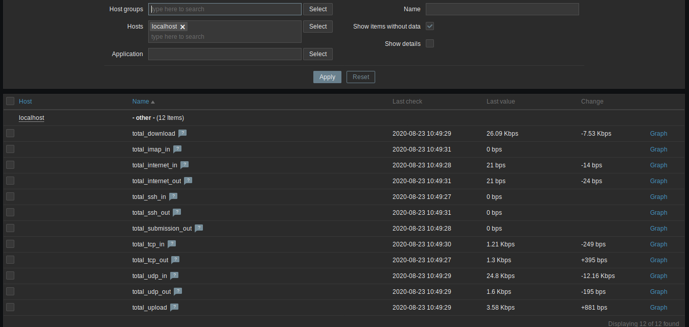
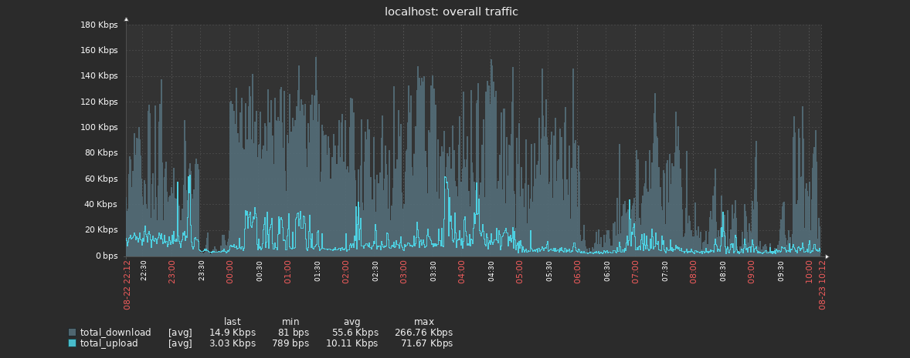
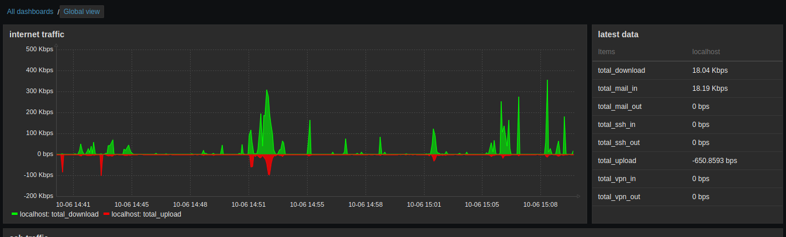
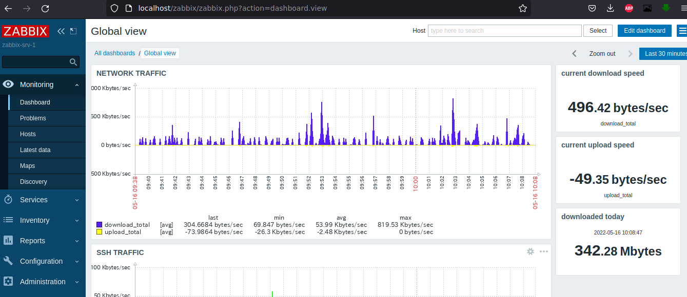

/!\ this version works with **nftables 9.8** - please consider using the relevant headers matching your nftables version, you will find them in the source code folder config.h and include/*.h

After compiling and making sure libnftables is available on your computer, cd to nftq folder then it compile with:
```
gcc -o nftq main.c getters.c processing.c  -lnftables -I ./headers/ -I ./headers/nftables/
```
run the program with no argument to get help.
```
nftq - simple program to query nftables counters - 
- must run as root
- must follow this arguments order:
nftq <family> <table> <chain> <comment/handle> [str_comment | int_handle_value] < packets/bytes>
 ```

NB: comment or handle is used by nftq to identify a rule (if several rules contain the exact same comment, nftq will match the first one it meets)
example:
```
sudo ./nftq  ip filter INPUT comment "total in" bytes
```

This program prints out bytes/packets (integers) retrieved from nftables ruleset.
Once you got the counters (bytes or packets), you can create graph(s) with your favorite monitoring solution (zabbix, munin, ... etc ...).

In my case, I use zabbix (https://www.zabbix.com/). As example, here is an upload/Download graph (1) and statistics provided by nftq to Zabbix web interface (2):

## nftq collected data by Zabbix:


## Generated graphs by zabbix (download/upload):


## Custom Zabbix dashboard showing graphs/data and stats:
A Zabbix dashboard that shows my overall internet consumption graph and a widget displaying latest statistics values:


## Additionnal widget that shows total download consumption:
A much more interesting feature of Zabbix is calculated item, which may interest some people. Things like showing (in realtime) download and upload consumption may be more than useful and combined with triggers, such information may help sysadmin set per user quota and alert. I personnaly use it to monitor my consumption:



